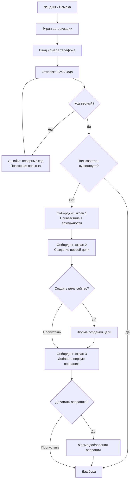
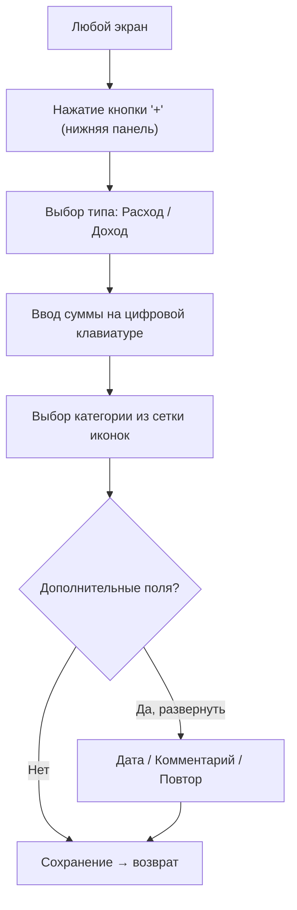
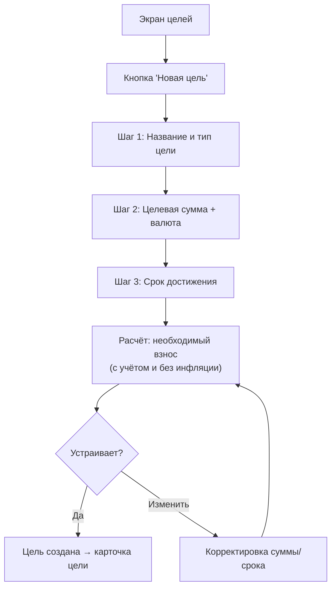
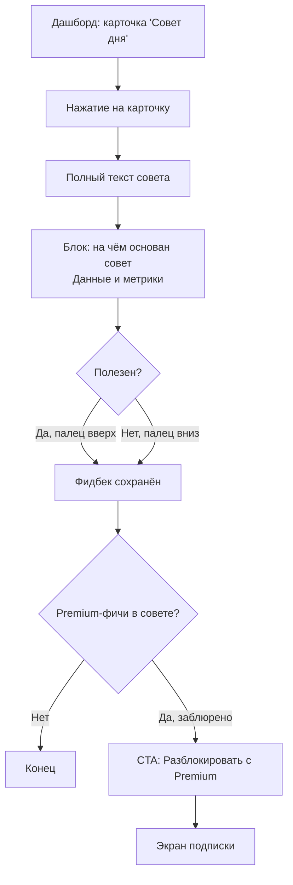
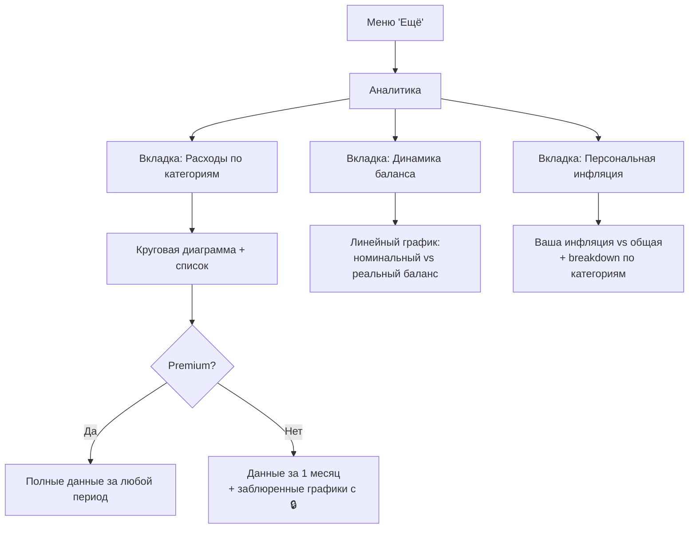
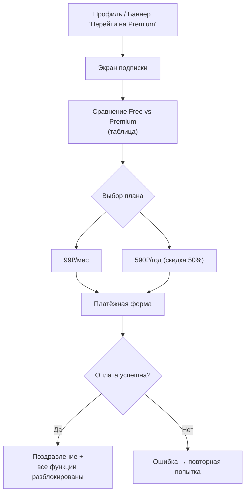

# Entropiq — UX-дизайн и пользовательские сценарии

**Версия:** 1.0
**Дата:** 2026-02-16

---

## Содержание

1. [Карта экранов](#1-карта-экранов)
2. [User Flows](#2-user-flows)
3. [Описание экранов](#3-описание-экранов)
4. [Библиотека UI-компонентов](#4-библиотека-ui-компонентов)
5. [Freemium-ограничения в интерфейсе](#5-freemium-ограничения-в-интерфейсе)
6. [Адаптивность](#6-адаптивность)

---

## 1. Карта экранов

### 1.1. MVP (этап 1)

```
Публичные (без авторизации)
├── Лендинг
├── Авторизация (телефон + SMS)
└── Калькулятор инфляции (вирусный инструмент)

Авторизованные
├── Дашборд (главный экран)
├── Операции
│   ├── Список операций
│   ├── Добавление операции
│   └── Редактирование операции
├── Цели
│   ├── Список целей
│   ├── Создание цели
│   ├── Детали цели (прогресс, сценарии)
│   └── Редактирование цели
├── Аналитика
│   ├── Расходы по категориям
│   ├── Динамика баланса (номинальный vs реальный)
│   └── Персональная инфляция
├── AI-советы
│   └── Список рекомендаций
├── Профиль
│   ├── Настройки профиля
│   ├── Подписка (free/premium)
│   ├── Уведомления
│   └── Язык
└── Онбординг (3 экрана, после первой авторизации)
```

### 1.2. Этап 2 (после защиты)

```
├── Семейные аккаунты
│   ├── Создание семьи
│   ├── Приглашение участников
│   └── Совместный бюджет
├── Экспорт отчётов (PDF/Excel)
├── Категории (управление)
├── Повторяющиеся операции (управление)
├── Достижения (геймификация)
└── Реферальная программа
```

### 1.3. Навигация

**Нижняя панель навигации (mobile-first):**

```
[Дашборд]  [Операции]  [+ Добавить]  [Цели]  [Ещё]
    🏠         📋          ➕          🎯      ☰
```

- **Дашборд** — главный экран с балансом и AI-советом
- **Операции** — список и фильтрация
- **+ Добавить** — центральная кнопка, быстрое добавление операции (акцентный цвет)
- **Цели** — список финансовых целей
- **Ещё** — аналитика, профиль, настройки, подписка

---

## 2. User Flows

### 2.1. Регистрация и онбординг



**Ключевые принципы:**
- Регистрация = авторизация (один flow, без отдельного экрана регистрации)
- Онбординг показывается только один раз, при первом входе
- Каждый шаг онбординга можно пропустить
- Онбординг ведёт к первому полезному действию (создание цели)

### 2.2. Добавление операции (3 действия)



**Ключевые принципы:**
- Минимум 3 действия: тип → сумма → категория
- Дата по умолчанию = сегодня (не нужно выбирать)
- Дополнительные поля скрыты, доступны по свайпу/нажатию
- После сохранения — мгновенный возврат к предыдущему экрану
- Виброотклик при сохранении (подтверждение)

### 2.3. Создание финансовой цели



**После создания цели пользователь видит:**
- Прогресс-бар (номинальный и реальный)
- Необходимый ежемесячный взнос
- Прогнозируемую дату достижения
- Три сценария (оптимистичный, базовый, пессимистичный)

### 2.4. Просмотр AI-совета



### 2.5. Просмотр аналитики



### 2.6. Управление подпиской



---

## 3. Описание экранов

### 3.1. Лендинг (публичный)

**Цель:** Конвертировать посетителя в зарегистрированного пользователя.

**Структура (сверху вниз):**

| Блок | Содержание |
|------|-----------|
| **Hero** | Заголовок: "Знайте реальную стоимость своих денег". Подзаголовок: "Финансовый помощник, который учитывает инфляцию". CTA: "Начать бесплатно". Визуал: анимированный дашборд с двумя линиями баланса. |
| **Проблема** | "500 000 ₽ через год — это уже не 500 000 ₽". Визуализация обесценивания. |
| **Калькулятор** | Встраиваемый виджет "Сколько инфляция съела ваших денег?" — ввод суммы, период, результат. Без регистрации. Вирусный инструмент. |
| **Возможности** | 3 карточки: учёт с инфляцией, AI-советы, финансовые цели. |
| **Сравнение с конкурентами** | Таблица: Entropiq vs Дзен-Мани vs CoinKeeper. Акцент на уникальных фичах. |
| **Отзывы** | 3 карточки (после бета-теста). |
| **Тарифы** | Free vs Premium. CTA: "Начать бесплатно". |
| **Footer** | Ссылки: FAQ, Политика конфиденциальности, Пользовательское соглашение, Контакты. |

### 3.2. Авторизация

**Цель:** Вход/регистрация за 30 секунд.

| Элемент | Описание |
|---------|---------|
| Логотип | Entropiq, сверху по центру |
| Заголовок | "Войти или создать аккаунт" |
| Поле ввода | Номер телефона с маской +7 (___) ___-__-__ |
| Кнопка | "Получить код" (disabled пока номер не валиден) |
| Юридический текст | "Нажимая кнопку, вы соглашаетесь с Условиями использования и Политикой конфиденциальности" |

**После нажатия "Получить код":**

| Элемент | Описание |
|---------|---------|
| Заголовок | "Введите код из SMS" |
| Подзаголовок | "Код отправлен на +7 (999) 123-45-67" |
| Поля ввода | 4 отдельных поля для цифр (auto-focus на следующее) |
| Таймер | "Отправить код повторно через 0:59" |
| Ссылка | "Изменить номер" |
| Обработка ошибки | Поля окрашиваются красным + текст "Неверный код" |

### 3.3. Онбординг (3 экрана)

**Экран 1 — Приветствие:**

| Элемент | Описание |
|---------|---------|
| Иллюстрация | Графики с двумя линиями (номинал vs реальный баланс) |
| Заголовок | "Добро пожаловать в Entropiq" |
| Текст | "Мы покажем реальную стоимость ваших денег с учётом инфляции и поможем достичь финансовых целей" |
| Кнопка | "Далее" |
| Индикатор | ● ○ ○ (точки прогресса) |

**Экран 2 — Первая цель:**

| Элемент | Описание |
|---------|---------|
| Иллюстрация | Прогресс-бар цели с флажком |
| Заголовок | "Поставьте финансовую цель" |
| Текст | "Мы рассчитаем, сколько нужно откладывать с учётом инфляции" |
| Кнопка primary | "Создать цель" → переход к форме цели |
| Кнопка secondary | "Позже" |
| Индикатор | ○ ● ○ |

**Экран 3 — Первая операция:**

| Элемент | Описание |
|---------|---------|
| Иллюстрация | Быстрый ввод (3 шага) |
| Заголовок | "Добавьте первую операцию" |
| Текст | "Это займёт 3 секунды. Начните отслеживать свои финансы прямо сейчас" |
| Кнопка primary | "Добавить операцию" → переход к форме |
| Кнопка secondary | "Начать с чистого листа" → дашборд |
| Индикатор | ○ ○ ● |

### 3.4. Дашборд (главный экран)

**Цель:** Мгновенный обзор финансового состояния. Первое, что видит пользователь.

**Структура (сверху вниз):**

| Блок | Содержание | Приоритет |
|------|-----------|-----------|
| **Header** | Приветствие "Привет, Имя" + аватар + иконка уведомлений | — |
| **Баланс** | Главная карточка: номинальный баланс (крупно) + реальный баланс (под ним, мельче, с подписью "в ценах начала года"). Между ними — разница со стрелкой вниз и красным цветом: "−43 379 ₽ из-за инфляции" | P0 |
| **Быстрые метрики** | Три мини-карточки в ряд: "Доходы за месяц" (зелёный), "Расходы за месяц" (красный), "Экономия" (синий) | P0 |
| **AI-совет** | Карточка с иконкой ✨: краткий текст совета + "Подробнее →". Для free: 1 совет/неделю. Заблюренный второй совет с 🔒 | P1 |
| **Цели** | Горизонтальная лента карточек целей (scroll). Каждая: название + прогресс-бар + "45 000 / 200 000 ₽" + дата. Если целей нет — CTA "Создайте первую цель" | P0 |
| **Последние операции** | 5 последних операций: иконка категории + название + сумма + дата. Внизу: "Все операции →" | P1 |
| **Персональная инфляция** | Мини-виджет: "Ваша инфляция: 10,2% (средняя по РФ: 9,5%)". Иконка информации с тултипом. Для free: заблюрено с 🔒 | P2 |

### 3.5. Список операций

**Цель:** Просмотр, фильтрация и управление операциями.

| Элемент | Описание |
|---------|---------|
| **Фильтры (верх)** | Тип (все / доходы / расходы) — tab-переключатель. Период (неделя / месяц / произвольный) — dropdown. Категория — dropdown с мульти-выбором. |
| **Поиск** | Строка поиска по комментариям к операциям |
| **Сводка** | "Доходы: 120 000 ₽ / Расходы: 85 000 ₽ / Баланс: +35 000 ₽" |
| **Список** | Группировка по дням. Каждый день: дата + сумма дня. Каждая операция: иконка категории, название категории, комментарий (если есть), сумма (зелёная для дохода, красная для расхода). Свайп влево → удалить. Нажатие → редактирование. |
| **Пагинация** | Бесконечный скролл (lazy loading) |
| **Пустое состояние** | "У вас пока нет операций. Добавьте первую!" + CTA |
| **Лимит (free)** | При 45+ операциях: баннер "Осталось 5 операций в этом месяце. Перейдите на Premium для безлимита" |

### 3.6. Добавление/редактирование операции

**Цель:** Максимально быстрый ввод (3 действия).

| Элемент | Описание |
|---------|---------|
| **Тип** | Переключатель "Расход / Доход" вверху (tab). По умолчанию — "Расход" |
| **Сумма** | Крупное поле ввода по центру. Цифровая клавиатура. Символ валюты (₽). |
| **Категории** | Сетка иконок 4×3 (или 4×4). Каждая: иконка + название. Наиболее используемые — первыми. "Ещё" → полный список. |
| **Дата** | По умолчанию "Сегодня" (показана как текст). Нажатие → date picker. |
| **Комментарий** | Текстовое поле, скрыто за "Добавить комментарий" |
| **Повтор** | Скрыт за "Сделать повторяющейся". Варианты: ежедневно, еженедельно, ежемесячно, ежегодно. |
| **Кнопка** | "Сохранить" (active при сумме > 0 и выбранной категории) |

**Категории (MVP, 20 штук):**

| | | | |
|---|---|---|---|
| 🛒 Продукты | 🏠 ЖКХ | 🚗 Транспорт | 👕 Одежда |
| 🍽️ Кафе/Рестораны | 💊 Здоровье | 📱 Связь | 🎓 Образование |
| 🎬 Развлечения | 🎁 Подарки | ✈️ Путешествия | 🏋️ Спорт |
| 🐾 Питомцы | 💇 Красота | 🛠️ Ремонт | 📦 Другое |
| 💰 Зарплата | 💵 Подработка | 🎰 Кэшбек | 📈 Проценты |

### 3.7. Список целей

**Цель:** Обзор всех финансовых целей и их прогресса.

| Элемент | Описание |
|---------|---------|
| **Кнопка** | "Новая цель" (вверху справа). Free: disabled после 1 цели с 🔒 |
| **Список карточек** | Каждая цель — карточка: |
| | Название цели + иконка типа (🏖️ Отпуск, 🏠 Квартира, 🚗 Авто, 💰 Подушка, 📦 Другое) |
| | Двойной прогресс-бар: верхний — номинальный (синий), нижний — реальный (с учётом инфляции, оранжевый) |
| | Текст: "45 000 / 200 000 ₽ (реально: 41 552 ₽)" |
| | Прогноз: "Достижение: сентябрь 2027" |
| | Нажатие → детальный экран цели |
| **Пустое состояние** | "Поставьте финансовую цель, и мы поможем её достичь! Рассчитаем, сколько откладывать с учётом инфляции." + CTA |

### 3.8. Детали цели

**Цель:** Полная информация о прогрессе, прогноз, сценарии.

| Блок | Содержание |
|------|-----------|
| **Header** | Название + иконка типа + кнопка "Редактировать" |
| **Прогресс** | Двойной прогресс-бар (номинальный + реальный). Числа: текущая сумма / целевая. Процент. |
| **Ключевые метрики** | 4 карточки: "Необходимый взнос/мес" (с инфляцией и без), "Осталось", "Прогноз даты", "Ваш темп" (опережаете/отстаёте). |
| **Сценарии** | Таблица или 3 карточки: Оптимистичный (инфляция 5%), Базовый (текущая), Пессимистичный (15%). Каждый: дата достижения + необходимый взнос. **Для free: заблюрено с 🔒** |
| **"Что если?"** | Слайдер: "Если откладывать на ___ ₽ больше/меньше". При движении пересчитывается дата и вероятность. **Для free: заблюрено с 🔒** |
| **График** | Линейный: план vs факт накоплений по месяцам. Две линии: номинал и реальная стоимость. |
| **Операции цели** | Список взносов, привязанных к этой цели |
| **Действия** | "Внести взнос" (быстрое добавление операции, привязанной к цели), "Удалить цель" |

### 3.9. Создание цели (форма)

| Шаг | Элемент | Описание |
|-----|---------|---------|
| 1 | Тип цели | Горизонтальный скролл карточек: 🏖️ Отпуск, 🏠 Квартира, 🚗 Авто, 💰 Подушка безопасности, 🎓 Образование, 📦 Другое |
| 1 | Название | Текстовое поле: "Название цели". Автозаполнение из типа. |
| 2 | Сумма | Цифровое поле. Валюта: ₽ (по умолчанию). |
| 2 | Начальная сумма | "Уже накоплено" — опционально, по умолчанию 0 |
| 3 | Срок | Выбор: date picker ИЛИ "через X месяцев" (preset: 3, 6, 12, 24, 36 мес) |
| — | Расчёт | Мгновенный пересчёт при изменении любого поля. Показывается: "Нужно откладывать: 15 894 ₽/мес (без инфляции) / 17 414 ₽/мес (с инфляцией 9,5%)" |
| — | Кнопка | "Создать цель" |

### 3.10. Аналитика

**3 вкладки (tabs):**

#### Вкладка 1: Расходы по категориям

| Элемент | Описание |
|---------|---------|
| Период | Переключатель: неделя / месяц / 3 месяца / год. Free: только месяц. |
| Диаграмма | Круговая (donut) с процентами. Нажатие на сектор → подсветка строки в списке. |
| Список | Категория (иконка + название) + сумма + процент + тренд (↑↓ vs прошлый период). Сортировка по сумме. |

#### Вкладка 2: Динамика баланса

| Элемент | Описание |
|---------|---------|
| Период | Переключатель: 3 мес / 6 мес / год / всё время. Free: 1 мес. |
| График | Линейный, 2 линии: номинальный баланс (синий) + реальный баланс (оранжевый). Интерактивный: нажатие на точку → tooltip с числами. |
| Легенда | "Номинальный" + "Реальный (с учётом инфляции)" |
| Разница | Текст под графиком: "Инфляция обесценила ваши накопления на 43 379 ₽ за выбранный период" |

#### Вкладка 3: Персональная инфляция

| Элемент | Описание |
|---------|---------|
| Главная метрика | Крупно: "Ваша инфляция: 10,2%". Рядом: "Средняя по РФ: 9,5%" |
| Объяснение | "Рассчитана на основе структуры ваших расходов и категориальных индексов Росстата" |
| Breakdown | Таблица: категория + доля в бюджете + ИПЦ категории + вклад в персональную инфляцию |
| **Для free** | Заблюрено с 🔒 + CTA Premium |

### 3.11. AI-советы

| Элемент | Описание |
|---------|---------|
| Список | Карточки советов. Каждая: дата + заголовок + краткий текст + "Подробнее →". Иконка ✨ |
| Детали совета | Полный текст + блок "На чём основан совет" (данные, метрики). Кнопки 👍 / 👎 |
| Free | 1 совет/неделю. Остальные заблюрены. Баннер: "Получайте советы ежедневно с Premium" |
| Пустое состояние | "Для первого совета нам нужны данные. Внесите операции за 1–2 недели, и мы дадим персонализированную рекомендацию" |

### 3.12. Профиль и настройки

| Раздел | Содержание |
|--------|-----------|
| **Профиль** | Аватар, имя (опционально), номер телефона. Кнопка "Выйти". |
| **Подписка** | Текущий план (Free/Premium). Дата окончания (для Premium). CTA "Перейти на Premium" / "Управление подпиской". |
| **Уведомления** | Переключатели: email-рассылка, push-уведомления о целях, еженедельный AI-совет. |
| **Язык** | Русский / English |
| **Валюта** | Базовая валюта (RUB по умолчанию) |
| **Данные** | Экспорт данных (CSV). Удаление аккаунта. |
| **О приложении** | Версия, ссылки на документы (ПК, ПС), FAQ, поддержка. |

### 3.13. Экран подписки

| Блок | Содержание |
|------|-----------|
| **Заголовок** | "Раскройте полный потенциал Entropiq" |
| **Сравнение** | Таблица Free vs Premium (чекмарки и крестики). Акцент на уникальных premium-фичах: сценарии, неограниченные советы, персональная инфляция, экспорт. |
| **Тарифы** | Две карточки: "99 ₽/мес" и "590 ₽/год (экономия 50%)". Годовой — выделен как рекомендуемый. |
| **Гарантия** | "7 дней — возврат без вопросов" |
| **Кнопка** | "Оформить подписку" |

### 3.14. Калькулятор инфляции (публичный)

**Цель:** Вирусный инструмент на лендинге. Работает без регистрации. Конвертирует в регистрацию.

| Элемент | Описание |
|---------|---------|
| Заголовок | "Сколько инфляция съела ваших денег?" |
| Поле 1 | "Сумма" — ввод числа |
| Поле 2 | "Когда вы их отложили?" — выбор даты (или preset: год назад, 2 года, 5 лет) |
| Результат | "Ваши 500 000 ₽, отложенные в январе 2025, сейчас эквивалентны 456 621 ₽. Инфляция обесценила 43 379 ₽." |
| Визуал | Анимированная полоса: было → стало |
| CTA | "Хотите защитить свои накопления? Создайте план в Entropiq" → регистрация |

---

## 4. Библиотека UI-компонентов

### 4.1. Базовые компоненты (Flux / Tailwind)

| Компонент | Варианты | Использование |
|-----------|---------|--------------|
| **Button** | primary, secondary, outline, danger, disabled | CTA, действия, навигация |
| **Input** | text, number, phone, search | Формы ввода |
| **Select** | single, multi, with search | Фильтры, выбор категории |
| **Toggle** | on/off | Настройки |
| **Tabs** | horizontal, underline | Навигация внутри экрана |
| **Card** | default, elevated, clickable | Контейнер контента |
| **Badge** | success, warning, danger, info, premium | Статусы, метки |
| **Modal** | dialog, bottom-sheet | Подтверждения, формы |
| **Toast** | success, error, info | Уведомления |

### 4.2. Бизнес-компоненты (кастомные)

| Компонент | Описание | Экраны |
|-----------|---------|--------|
| **BalanceCard** | Номинальный + реальный баланс, разница, тренд | Дашборд |
| **QuickStats** | 3 мини-карточки в ряд (доходы, расходы, экономия) | Дашборд |
| **TransactionRow** | Иконка категории + текст + сумма + дата. Свайп-действия. | Операции, дашборд |
| **TransactionForm** | Тип + сумма + категории + доп. поля | Добавление операции |
| **CategoryGrid** | Сетка иконок категорий (4 в ряд) | Добавление операции, фильтры |
| **GoalCard** | Название + двойной прогресс-бар + метрики + прогноз | Дашборд, список целей |
| **DualProgressBar** | Два прогресс-бара (номинальный + реальный) с легендой | Цели |
| **ScenarioTable** | 3 сценария (оптимист/базовый/пессимист) с метриками | Детали цели |
| **WhatIfSlider** | Слайдер + мгновенный пересчёт метрик | Детали цели |
| **AiAdviceCard** | Иконка ✨ + заголовок + текст + "Подробнее". Вариант: заблюренный | Дашборд, AI-советы |
| **InflationWidget** | Персональная инфляция vs средняя. Мини-виджет. | Дашборд |
| **PremiumLock** | Overlay с 🔒 + CTA "Разблокировать с Premium" | Везде, где free ограничен |
| **DonutChart** | Круговая диаграмма расходов (ApexCharts) | Аналитика |
| **LineChart** | Линейный график (2 линии: номинал + реальный) (ApexCharts) | Аналитика, цели |
| **PhoneInput** | Поле телефона с маской +7 | Авторизация |
| **OtpInput** | 4 отдельных поля для SMS-кода | Авторизация |
| **OnboardingSlide** | Иллюстрация + заголовок + текст + CTA + индикатор | Онбординг |
| **EmptyState** | Иллюстрация + текст + CTA | Везде при отсутствии данных |
| **BottomNav** | 5 иконок навигации с badge-ами | Все экраны |

### 4.3. Цветовая схема

| Назначение | Цвет | Использование |
|-----------|------|--------------|
| Primary | Индиго (#4F46E5) | Кнопки CTA, акценты, активные элементы |
| Success / Доходы | Зелёный (#10B981) | Суммы доходов, положительные тренды |
| Danger / Расходы | Красный (#EF4444) | Суммы расходов, ошибки, отрицательные тренды |
| Warning / Инфляция | Оранжевый (#F59E0B) | Реальный баланс, инфляционные метрики |
| Premium | Фиолетовый (#8B5CF6) | Premium-бейджи, CTA подписки |
| Neutral | Серый (#6B7280) | Вторичный текст, разделители |
| Background | Светло-серый (#F9FAFB) | Фон страницы |
| Surface | Белый (#FFFFFF) | Карточки, модалки |

### 4.4. Типографика

| Уровень | Размер | Вес | Использование |
|---------|--------|-----|--------------|
| H1 | 28px | Bold | Заголовки экранов |
| H2 | 22px | Semibold | Заголовки секций |
| H3 | 18px | Semibold | Заголовки карточек |
| Body | 16px | Regular | Основной текст |
| Caption | 14px | Regular | Вторичный текст, подписи |
| Small | 12px | Regular | Метки, badge-и |
| Number (баланс) | 32px | Bold | Главная сумма на дашборде |
| Number (метрика) | 20px | Semibold | Суммы в карточках |

---

## 5. Freemium-ограничения в интерфейсе

### 5.1. Принцип

Бесплатный пользователь **видит** ценность premium-функций, но **не может** ими воспользоваться. Заблюренный контент с 🔒 создаёт желание разблокировать.

### 5.2. Карта ограничений

| Функция | Free | Premium | Как показано в UI |
|---------|------|---------|------------------|
| Операции | До 50/мес | Без лимита | Баннер при приближении к лимиту |
| Категории | 10 базовых | 20 | "Ещё категории" → 🔒 |
| Цели | 1 | До 10 | Кнопка "Новая цель" → 🔒 |
| AI-советы | 1/неделю | Ежедневно | Заблюренные карточки с 🔒 |
| Инфляция | За 1 месяц | За любой период | Заблюренный график с 🔒 |
| Сценарии целей | — | 3 сценария | Заблюренные карточки с 🔒 |
| "Что если?" | — | Слайдер | Заблюренный блок с 🔒 |
| Персональная инфляция | — | Полный расчёт | Заблюренный виджет с 🔒 |
| Экспорт | — | PDF/Excel | Кнопка → 🔒 |
| Аналитика (период) | 1 месяц | Любой | Вкладки периодов → 🔒 |

### 5.3. Точки конверсии (upsell)

| Момент | Сообщение |
|--------|----------|
| 40 операций в месяце | "Осталось 10 операций. Перейдите на Premium — без лимитов" |
| Попытка создать 2-ю цель | "С Premium вы можете ставить до 10 целей одновременно" |
| Нажатие на заблюренный совет | "Получайте персональные AI-советы каждый день" |
| Нажатие на заблюренный сценарий | "Узнайте, как разные условия повлияют на вашу цель" |
| 7 дней после регистрации | Push/email: "Специальное предложение: первый месяц Premium за 1 ₽" |
| 14 дней после регистрации | Push/email: "Годовая подписка со скидкой 30% — только 413 ₽" |

---

## 6. Адаптивность

### 6.1. Breakpoints

| Breakpoint | Диапазон | Поведение |
|-----------|---------|-----------|
| Mobile | < 640px | Основной дизайн. Нижняя навигация. Одноколоночная сетка. |
| Tablet | 640–1024px | Боковая панель навигации (collapsed). Двухколоночная сетка на дашборде. |
| Desktop | > 1024px | Боковая панель навигации (expanded). Трёхколоночный дашборд. Графики крупнее. |

### 6.2. Mobile-first

Дизайн проектируется в первую очередь для мобильного разрешения (375px ширина — iPhone SE). Причины:
- 80%+ ЦА будет использовать с телефона
- Мобильная версия сложнее — если работает на mobile, desktop адаптация проще
- Подготовка к будущему мобильному приложению / PWA

### 6.3. Особенности desktop-версии

| Элемент | Mobile | Desktop |
|---------|--------|---------|
| Навигация | Нижняя панель (5 иконок) | Левая боковая панель с текстовыми пунктами |
| Дашборд | Одна колонка, вертикальный скролл | 3 колонки: баланс+метрики, цели+советы, последние операции |
| Графики | Компактные, свайп для навигации | Полноразмерные, hover-интерактивность |
| Добавление операции | Полноэкранная форма | Модальное окно |
| Онбординг | Полноэкранные слайды | Центрированное модальное окно |
